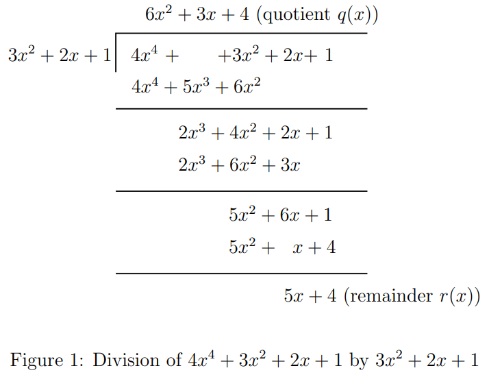
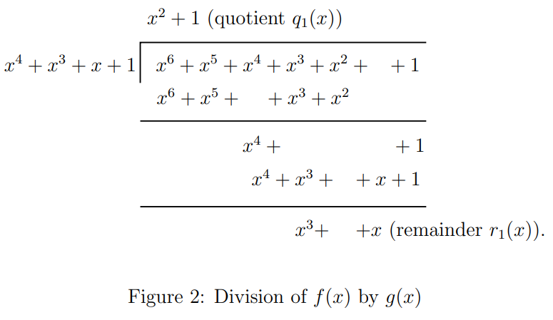
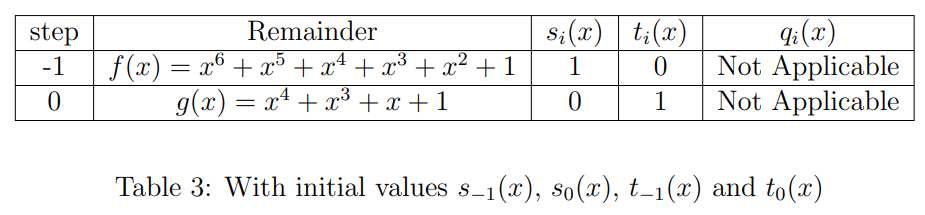

In all the previous experiments, we dealt with codes over the binary alphabet. Codes can also be constructed over fields of size greater than $2$. In this experiment, we shall focus on finite fields in general. Firstly, we will describe prime fields denoted by $\mathbb{F}_{p}$, where $p$ is a prime number. Then we study the construction of finite fields ($\mathbb{F}_{q}$) of size $q$, which is a power of a prime ($q = p^{m}$, $m \geq 2$). Then we describe the element through which every element of the finite field can be generated (primitive element) and the construction of minimal polynomials of all the elements.

The theory associated with Experiment-6 is divided into four parts:

1. Prime Fields
2. Ring of polynomials and Extended Euclidean algorithm
3. Construction of finite fields of prime power
4. Structural Properties of Finite Fields
   - Vector space structure of finite fields
   - Multiplicative structure of finite fields
   - Minimal Polynomials

---

### 1. Prime Fields

Consider a set $\mathbb{F}_p = \{0, 1, \ldots, p-1 \}$, where $p$ is prime. The addition and multiplication operations for any $a, b \in \mathbb{F}_p$ are defined as $a +_p b = a+b \mod p$ and $a ._p b = a.b \mod p$. For simplicity of notation, we will use $+$ instead of $+_p$ and $.$ instead of $._p$ subsequently in the theory.

We would like to argue that $(\mathbb{F}_p, +, .)$ is a field. In Experiment-1, field definition is given. It is easy to verify the following field properties of $(\mathbb{F}_p, +, .)$:

- Closure under addition, multiplication
- Commutativity under addition, multiplication
- Distributivity with respect to addition and multiplication
- Additive identity is $0$ and multiplicative identity is $1$
- Additive inverse of $a$ is $p-a$

The only property which requires to be verified carefully is the existence of multiplicative inverse for every non-zero element in the field. In order to prove that, we need to invoke the fact that $p$ is prime. We also use the well-known relation of the greatest common divisor ($gcd$), i.e., for integers $a$ and $b$ there are two integers $x$ and $y$ such that

$$
ax + py = 1
$$

Consider $a \neq 1 \in \mathbb{F}_p$.
$a$ is co-prime with $p$ as $p$ is a prime number.
Hence, $gcd(a,p)=1$. Thus, there are two integers $x,y$ such that $ax + py = 1$. Doing $\mod p$ operation on the above relation, we have that $a \cdot (x \mod p) = 1 \mod p$. Thus, $x \mod p$ is the required multiplicative inverse of $a$ in the field $\mathbb{F}_p$.

Consider the case of $p=7$. The addition and multiplication tables for $\mathbb{F}_7$ are given below. For example, $(4+5) \mod 7 = 2$ and $(4 \cdot 5) \mod 7 = 6$. In this field, the additive inverse of an element $a$ is $7-a$. For example, additive inverse of $5$ is $7-5=2$. The multiplicative identity is $1$ in $\mathbb{F}_{7}$, so the multiplicative inverse of an element $a$ is $b$ if and only if $a \cdot b = 1$. For example, the multiplicative inverse of $5$ is $3$ (check from Table 2). Students are suggested to find the multiplicative inverses of all the elements from Table 2 and additive inverses of all the elements from Table 1.

<b>Table 1: Addition table for $\mathbb{F}_7$</b> 

<b>Table 2: Multiplication table for $\mathbb{F}_7$</b> 

---

### 2. Ring of Polynomials and Extended Euclidean Division Algorithm

In Experiment-1, we have defined the field $\{\mathbb{F}, +, \cdot\}$. Students are suggested to recall the axioms that satisfy with two binary operations called addition $(+)$ and multiplication $(\cdot)$ (see Section 1 in the current experiment). Let $R$ be a set of elements, known as a ring, which satisfies all the field axioms but does not necessarily require the presence of multiplicative inverses and doesn't require satisfying the commutative property with respect to multiplication. It is denoted by $\{R, +, \cdot\}$. Consider the set of all polynomials with coefficients from $\mathbb{F}_p$, denoted by $\mathbb{F}_p[x]$ where $x$ is indeterminate. It is easy to verify that $(\mathbb{F}_p[x],+,.)$ is a ring of polynomials. Addition and multiplication are defined as ordinary addition and multiplication, with the difference being the coefficient operations are carried out $\mod p$.

For example, consider the ring of polynomials $\mathbb{F}_7[x]$. Let $a(x) = 1 + 3x + 4x^2 + x^3 + 6x^5 $ and $b(x) = 2 + 5x^2  + 5x^5 + x^6$, then we have that

$$
a(x) + b(x) = 3 + 3x + 2 x^2 + x^3 + 4x^5 + x^6
$$

We also can compute the product of $a(x)$ and $b(x)$ as follows:

$$
a(x) b(x) = (1 + 3x + 4x^2 + x^3 + 6x^5) (2 + 5x^2 + 5x^5 + x^6)
$$

$$
= 2 + 6x + 6x^2 + 3x^3 + 6x^4 + x^5 + 2x^6 + 4x^7 + 2x^8 + x^9 + 2x^{10} + 6x^{11}
$$

Let $a(x) = 4x^4 + 3x^2 + 2x + 1 $ and $b(x) = 3x^2 + 2x + 1 $ are the two polynomials in $\mathbb{F}_{7}[x]$. The division of $a(x)$ by $b(x)$ is computed as follows:

Division algorithm for polynomials states that there is a unique representation for $a(x)$ and $b(x)$ in $\mathbb{F}[x]$ ($\mathbb{F}$ is a field), $a(x) = q(x) b(x) + r(x)$, where the degree of $r(x)$ is less than the degree of $b(x)$. Throughout the experiment, we denote the degree of any polynomial, say $f(x)$ by $deg(f(x))$. Sometimes it is convenient to express the remainder polynomial in terms of the modulo operation, as we do for integers, i.e., $r(x) = a(x) \mod b(x)$. Using the division algorithm repetitively, the $gcd$ of two polynomials is determined, which is discussed below.

**Euclidean Algorithm:** To compute the $gcd(f(x), g(x))$, the division algorithm is used repetitively. Repeated application of the division algorithm, we obtain a series of equations:

$$
f(x) = q_{1}(x) g(x) + r_{1}(x) \\
g(x) = q_{2}(x) r_{1}(x) + r_{2}(x) \\
r_{1}(x) = q_{3}(x) r_{2}(x) + r_{3}(x) \\
\vdots \\
r_{j-2}(x) = q_{j}(x) r_{j-1}(x) + r_{j}(x) \\
r_{j-1}(x) = q_{j+1}(x) r_{j}(x)
$$

Then $gcd(f(x), g(x)) = r_{j}(x)$, the last nonzero remainder of the division process. Let's understand the procedure to find the $gcd$ of two polynomials with the following example.

**Example 1:**  
Consider the polynomials $f(x) = x^6 + x^5 + x^4 + x^3 + x^2 + 1$ and $g(x) = x^4 + x^3 + x + 1$ from $\mathbb{F}_{2}[x]$. Remember that all the operations are performed modulo 2. We will apply the Euclidean algorithm to find the $gcd(f(x),g(x))$.

Therefore by applying the division algorithm for the polynomials $f(x)$ and $g(x)$ we get

$$
f(x) = (x^2+1) g(x) + (x^3+x)
$$

Here, quotient $q_{1}(x) = (x^2+1)$ and the remainder $r_{1}(x) = x^3+x$.

**Step 2:**  
Next, we apply division algorithm for the polynomials $g(x) = x^4 + x^3 + x + 1$ and $r_{1}(x) = x^3+x$ we get

$$
g(x) = (x+1) r_{1}(x) + (x^2+1)
$$

Here, quotient $q_{2}(x) = (x+1)$ and the remainder $r_{2}(x) = x^2+1$.

**Step 3:**  
Next, we apply division algorithm for the polynomials $r_{1}(x) = x^3+x$ and $r_{2}(x) = x^2+1$ we get

$$
r_{1}(x) = (x) r_{2}(x)
$$

Since the remainder $r_{3}(x)=0$, the Euclidean algorithm terminates here, and the last non-zero remainder is $r_{2}(x) = (x^2+1)$. Therefore $gcd(f(x),g(x)) = (x^2+1)$.

The relation of the greatest common divisor of two polynomials is analogous to integers. For any two polynomials $f(x)$ and $g(x)$, there exists polynomials $s(x)$ and $t(x)$ such that

$$
gcd(f(x),g(x)) = s(x) f(x) + t(x) g(x)
$$

In further discussion, we always consider $f(x)$ is the dividend and $g(x)$ is the divisor. The relation above is used to find the construction of finite fields of prime power (also called Galois fields) and is described in Section 3. The well-known extended Euclidean Algorithm for polynomials for finding $s(x)$ and $t(x)$ is given below. In this algorithm, the remainder $r_{i}(x)$ and the quotient $q_{i}(x)$ determined at the $i$th step of the Euclidean algorithm are used.

**Extended Euclidean Division Algorithm:**  
The polynomials $s(x)$ and $t(x)$ are computed by finding intermediate polynomials $s_{i}(x)$ and $t_{i}(x)$ satisfying

$$
r_{i}(x) = s_i(x) f(x) + t_i(x) g(x)
$$

at every step of the algorithm. The quotient $q_{i}(x)$ obtained at the $i$th step of the Euclidean algorithm is used to update $s_{i}(x)$ and $t_{i}(x)$:

$$
s_{i}(x) = s_{i-2}(x) - q_{i}(x) s_{i-1}(x)
$$

$$
t_{i}(x) = t_{i-2}(x) - q_{i}(x) t_{i-1}(x)
$$

for $i = 1,2, \ldots$ (until termination), with

$$
s_{-1}(x) = 1, \quad s_{0}(x) = 0 \\
t_{-1}(x) = 0, \quad t_{0}(x) = 1
$$

We have seen that the last non-zero remainder $r_{j}$ obtained in the Euclidean algorithm is the $gcd(f(x),g(x))$. So, the extended Euclidean algorithm terminates when the last non-zero remainder is expressed as above. The corresponding $s_{j}(x)$ and $t_{j}(x)$ resulted as $s(x)$ and $t(x)$ of the $gcd(f(x),g(x))$. In the following example, we determine the polynomials $s(x)$ and $t(x)$ for Example 1.

**Example 2:**  
Consider Example 1. We have obtained $gcd(f(x), g(x)) = x^2+1$. A series of equations obtained in the Euclidean algorithm are used sequentially to determine the $s(x)$ and $t(x)$. We start with the initial values given above, and tabulated in Table 4.

<b>Table 3: Initial values for Extended Euclidean Algorithm</b> 

We will apply the extended Euclidean algorithm step by step till we get the remainder zero.

**Step 1:**  
At this step we determine $s_{1}(x)$ and $t_{1}(x)$. For this, we need the quotient $q_{1}(x) = (x^{2}+1)$ obtained at the first step of the Euclidean algorithm, and the initial values from the above table. From the update equations:

$$
s_{1}(x) = s_{-1}(x) - q_{1}(x) s_{0}(x) = 1 - (x^{2}+1) \cdot 0 = 1
$$

$$
t_{1}(x) = t_{-1}(x) - q_{1}(x) t_{0}(x) = 0 - (x^{2}+1) \cdot 1 = x^{2}+1
$$

At the first step of the Euclidean algorithm, the remainder is $r_{1}(x) = x^3+x$. Students are suggested to verify that $r_{1}(x) = s_{1}(x) f(x) + t_{1}(x) g(x)$.
Table 5 shows all the values that have been obtained till now.

<b>Table 4: Values after Step 1 of Extended Euclidean Algorithm</b> 

**Step 2:**  
As done in Step 1, at this step we determine $s_{2}(x)$ and $t_{2}(x)$. For this we need the values obtained in Table 5 and the quotient $q_{2}(x) = (x+1)$ obtained in step 2 of the Euclidean algorithm. From the update equations:

$$
s_{2}(x) = s_{0}(x) - q_{2}(x) s_{1}(x) = 0 - (x+1) \cdot 1 = x+1
$$

$$
t_{2}(x) = t_{0}(x) - q_{2}(x) t_{1}(x) = 1 - (x+1)(x^{2}+1) = x^{3}+x^{2}+x
$$

At this step, the remainder is $r_{2}(x) = x^2+1$. Table 6 shows all the values obtained till now. Students are encouraged to confirm that $r_{2}(x) = s_{2}(x) f(x) + t_{2}(x) g(x)$.

<b>Table 5: Values after Step 2 of Extended Euclidean Algorithm</b> 

Note that the Euclidean algorithm for this example terminates here, since $r_{3}(x) = 0$, and the $gcd(f(x),g(x))= r_{2}(x) = (x^2+1)$. Therefore the extended Euclidean algorithm also terminates here, and $r_{2}(x) = s_{2}(x) f(x) + t_{2}(x) g(x)$. That is,

$$
gcd(f(x),g(x)) = r_{2}(x) = (x^2+1) = (x+1) f(x) + (x^3+x^2+x) g(x)
$$

Hence for this example the polynomials $s(x) = (x+1)$ and $t(x) = (x^3+x^2+x)$. From the previous step we know the remainder $r_{3}(x)=0$ and the quotient $q_{3} = x$. Hence with all these values we obtain the final table of the algorithm (Table 7):

<b>Table 6: Final values of Extended Euclidean Algorithm</b> 

---

### 3. Construction of Finite Fields

In this section, we provide fundamental definitions necessary for building finite fields. These definitions are essential for the construction process.

**Monic Polynomial:**  
Consider a polynomial $f(x)$ of degree $d$, given by $f(x) = \sum_{i=0}^d f_i x^i$. $f(x)$ is said to be monic if $f_d=1$.

**Irreducible Polynomial:**  
A monic polynomial $f(x)$ over $\mathbb{F}_p$ of degree $d$ is said to be irreducible if it cannot be factored into the form:

$$
f(x) = g(x) h(x)
$$

where $0 < \text{deg}(g(x)), \text{deg}(h(x)) < \text{deg}(f(x)) = d$.

Consider a binary field with $p=2$ and $\mathbb{F}_2 = \{0,1\}$. The list of all irreducible polynomials over $\mathbb{F}_2$ up to degree 4 are given in the table below:

<b>Table 7: Irreducible polynomials over $\mathbb{F}_2$ up to degree 4</b> 

It can be shown that for every prime $p$, and every integer $m \geq 1$, irreducible polynomials of degree $m$ exist.
Consider the set $\mathbb{F}_p[x]/f(x)$, where $f(x)$ is irreducible of degree $m \geq 2$. $\mathbb{F}_p[x]/f(x)$ is the collection of equivalence classes. Where we define

$$
a_1(x) \sim a_2(x) \text{ if and only if } f(x) \text{ divides } (a_1(x) - a_2(x))
$$

which means $(a_1(x) - a_2(x))$ is a multiple of $f(x)$. Each equivalence class represents an element in the finite field. These equivalence classes can be denoted as $[a(x)]$, where $a(x)$ is a representative polynomial within that class. This class includes all the polynomials whose division by $f(x)$ gives the remainder $a(x)$. For simplicity of notation, the element $[a(x)]$ is represented as $a(x)$. From this, we can see that the field $\mathbb{F}_p[x]/f(x)$ is the collection of all the polynomials of degrees less than or equal to $m-1$. It is easy to verify the field properties (see Section 1) of $\mathbb{F}_p[x]/f(x)$. Students are encouraged to verify all the field properties carefully. The critical thing to verify is that every nonzero element in the field has another element with which you can multiply it to get 1 (the multiplicative inverse) which is discussed below.

Consider any non-zero element $a(x)$ from the field $\mathbb{F}_p[x]/f(x)$. Since $f(x)$ is the irreducible polynomial of degree $m$, the $gcd(f(x),a(x)) = 1$. From the previous section, there are two polynomials $s(x)$ and $t(x)$ such that $s(x)f(x)+t(x)a(x) = 1$. By performing a modulo operation with the irreducible polynomial $f(x)$, we get $(t(x) \mod f(x))a(x) = 1$. Thus $(t(x) \mod f(x))$ is the multiplicative inverse of $a(x)$ in the field $\mathbb{F}_p[x]/f(x)$.

For example, consider irreducible polynomial $f(x) = x^2+x+1$ over $\mathbb{F}_{2}[x]$. Then $\mathbb{F}_{2^2} = \mathbb{F}_2[x]/(x^2+x+1) = \{ [0], [1], [x], [x+1] \} \triangleq \{ 0, 1, x, x+1 \}$. In this, each element is an equivalence class. Consider an element $[x]$ from $\mathbb{F}_{2^2}$, this class includes all polynomials over $\mathbb{F}_2[x]$ which gives the remainder $x$ with modulo $(x^2+x+1)$. In this field, the multiplicative inverse of $x$ is $x+1$, since $(x) \cdot (x+1) = x^2+x = 1$.

---

### 4. Structural Properties of Finite Fields

#### 4.1 Vector Space Structure of a Finite Field

Consider a finite field $\mathbb{F}_q$ with $q$ elements. The characteristic $p$ of $\mathbb{F}_q$ is the smallest integer $p$ such that $\underbrace{1 + 1 + \ldots + 1}_{p \text{ times}} = 0$ in $\mathbb{F}_q$. Hence, $\mathbb{F}_q$ contains the set $\{0,1,\ldots, p-1\}$.

The arithmetic used to operate on these elements is $\mod p$ arithmetic since $p \equiv 0$ in $\mathbb{F}_q$. It can be shown that the characteristic $p$ is a prime. Hence, $\mathbb{F}_q$ contains a copy of $\mathbb{F}_p$. It can be shown that if $\mathbb{E}$ and $\mathbb{F}$ are fields and $\mathbb{E} \supseteq \mathbb{F}$, then $\mathbb{E}$ is a vector space over $\mathbb{F}$. It follows that $\mathbb{F}_q$ is a vector space over $\mathbb{F}_p$. Let $m$ be the dimension of this vector space over $\mathbb{F}_p$. Then, we have

$$
\mathbb{F}_q = \left\{ \sum_{i=1}^m a_i \underline{\gamma}_i \mid a_i \in \mathbb{F}_p \right\}
$$

where $\{ \underline{\gamma}_1, \ldots, \underline{\gamma}_m \}$ is a basis of $\mathbb{F}_q$ over $\mathbb{F}_p$. It follows that $\mathbb{F}_q$ is of size $p^m$. Thus, every finite field $\mathbb{F}_q$ has size $q$ of the form $q = p^m$, $p$ prime, $m \geq 1$ (moreover $p$ is the characteristic of $\mathbb{F}_q$).

For example, consider $\mathbb{F}_{2^4} = \mathbb{F}_2[x]/(x^4+x+1)$. The basis of $\mathbb{F}_{2^4}$ over $\mathbb{F}_{2}$ is $S = \{(1\,0\,0\,0), (0\,1\,0\,0), (0\,0\,1\,0), (0\,0\,0\,1)\}$ and $\mathbb{F}_{2^4}$ is the vector space spanned by the set $S$ over $\mathbb{F}_{2}$ which has size $2^4$.

#### 4.2 Multiplicative Structure of a Finite Field

We denote $\mathbb{F}_q^* = \mathbb{F}_q \setminus \{0\}$. The multiplicative order of $\beta \in \mathbb{F}_q^*$ is the smallest exponent $e$ such that $\beta^e = 1$. Every finite field $\mathbb{F}_q$ contains an element $\alpha$ of order $q-1$. In terms of $\alpha$, $\mathbb{F}_q$ has the representation

$$
\mathbb{F}_q = \{0\} \cup \{ \alpha^i \mid 0 \leq i \leq q-2 \}
$$

An element $\alpha \in \mathbb{F}_q^*$ of order $q-1$ is called a primitive element of $\mathbb{F}_q$. Multiplicative inverse of any $\alpha^{j}$ ($1 \leq j \leq q-1$) is $\alpha^{q-1-j}$, since $(\alpha^{j}) \cdot (\alpha^{q-1-j}) = \alpha^{q-1} = 1$.

For example, consider $\mathbb{F}_{2^4} = \mathbb{F}_2[x]/(x^4+x+1)$. Note that $x^4+x+1$ is irreducible over $\mathbb{F}_2$. Denote $\alpha = [x]$, the equivalence class of $[x]$ in $\mathbb{F}_2[x]/(x^4+x+1)$. Alternately, we may regard $\alpha$ as the imaginary element satisfying $\alpha^4+\alpha+1=0$. Now, we will show that we can express all the non-zero elements of $\mathbb{F}_2[x]/(x^4+x+1)$ as powers of $\alpha$ (see Table 9).
In Table 9, we get an element by multiplying the previous element by $\alpha$ and then applying the condition $\alpha^4+\alpha+1 = 0$. We also use the condition every element is its own additive inverse. This is because the characteristic of the field is $2$. For example, let's calculate the polynomial representation of $\alpha^8$,

$$
\alpha^8 = \alpha^7 \cdot \alpha = (\alpha^3+\alpha+1) \cdot \alpha = \alpha^4+\alpha^2+\alpha \\
= (\alpha+1)+\alpha^2+\alpha = \alpha^2+1
$$

In this field, the multiplicative inverse of any $\alpha^{j}$ ($1 \leq j \leq 15$) is $\alpha^{15-j}$, since $(\alpha^{j}) \cdot (\alpha^{15-j}) = \alpha^{15} = 1$. For example, multiplicative inverse of $\alpha^3$ is $\alpha^{12}$.

<b>Table 8: Powers of $\alpha$ in $\mathbb{F}_{2^4}$</b> 

As a part of the study of finite fields, we will discuss the construction of minimal polynomials, which are useful in constructing codes that we will discuss in Experiment 9.

#### 4.3 Minimal Polynomials

The minimal polynomial $m_{\beta}(x)$ of $\beta \in \mathbb{F}_q^*$ is the smallest degree monic polynomial in $\mathbb{F}_p[x]$ of which $\beta$ is a zero. Some properties of the minimal polynomial (without proofs) are given below:

- $m_{\beta}(x)$ is an irreducible polynomial.
- If $f(\beta) = 0$, then $m_{\beta}(x) \mid f(x)$, i.e., if $\beta$ is a root of $f(x)$, then $m_{\beta}(x)$ divides $f(x)$.
- Applying the above fact, we have that $m_{\beta}(x) \mid (x^q - x)$. This is because all the elements of field $\mathbb{F}_q$ satisfy the equation $x^q = x$.
- For a non-zero element $\beta$, all the distinct elements of $\{\beta^p, \beta^{p^2}, \ldots, \beta^{p^{m}}\}$, where $p$ is the characteristic of $\mathbb{F}_q$, are all termed as conjugates of the element $\beta$. Let $C_{\beta}$ denote the set of all conjugates of the element $\beta$ including $\beta$ itself.
- $m_{\beta}(x) = \prod_{\gamma \in C_{\beta}} (x-\gamma)$. In particular, an element and all its conjugates have the same minimal polynomial.

**Example 3:**  
Consider the Galois field $\mathbb{F}_{2^{4}}$ such that $1+\alpha+\alpha^{4} = 0$ (see Table 9). Suppose we want to determine the minimal polynomial $\phi(X)$ of $\beta = \alpha^{7}$ in $\mathbb{F}_{2^{4}}$. Recall that conjugates of $\beta$ are the distinct elements $\beta^p, \beta^{p^2}, \ldots, \beta^{p^{m}}$, where $p$ is the characteristic of $\mathbb{F}_{p^{m}}$ (here $p=2$). So the conjugates of the element $\beta=\alpha^{7}$ are $\alpha^{14}, \alpha^{13}, \alpha^{11}$ and $\alpha^{7}$. Hence, the minimal polynomial of $\beta = \alpha^{7}$ is

$$
\begin{align*}
\phi(X) & = (X+\alpha^{7}) (X+\alpha^{11}) (X+\alpha^{13}) (X+\alpha^{14}) \\
& = [X^{2}+(\alpha^{7}+\alpha^{11})X+\alpha^{18}] [X^{2}+(\alpha^{13}+\alpha^{14})X+\alpha^{27}]   \\
& = (X^{2}+\alpha^{8}X+\alpha^{3}) (X^{2}+\alpha^{2} X+\alpha^{12})      \\
& = X^{4} + (\alpha^{2} + \alpha^{8}) X^{3} + (\alpha^{12}+\alpha^{10}+\alpha^{3}) X^{2} + (\alpha^{5} + \alpha^{5}) X  + \alpha^{15} \\
& = X^{4} + X^{3} +1
\end{align*}
$$
### Link your theory in here
